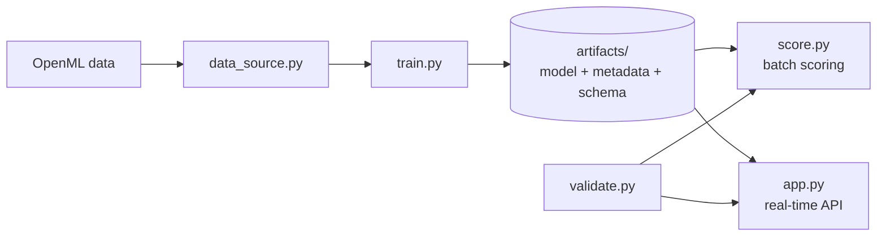

# auto-pd: Auto Loan PD Model, from Notebook to Production

A small, end-to-end machine learning engineering project that takes a credit risk **probability of default (PD)** model for auto loans and builds the production plumbing around it: a data access layer, a versioned model artifact, a data contract with validation, batch scoring, a real-time scoring API, and a reproducible one-command pipeline.

The model itself is intentionally simple (logistic regression). The point of this project is everything *around* the model, the part that keeps a model working reliably, consistently, and auditably after development is done.

> This is a learning project built step by step while studying MLOps and cloud model deployment, written from the perspective of a credit risk modeler. It is not a production credit model.

---

## What this project demonstrates

| MLOps stage | How it is implemented here |
|---|---|
| Data access | A single data layer (`data_source.py`) that is the only code aware of where data comes from |
| Training | A scikit-learn pipeline that bundles preprocessing and the model into one artifact |
| Packaging | A serialized model plus metadata recording version, data fingerprint, and environment |
| Data contract | An input schema generated from training data and saved alongside the model |
| Validation | Two-tier checks: hard errors block scoring, warnings flag extrapolation |
| Batch serving | A scheduled-style scoring job with lineage on every output row |
| Real-time serving | A FastAPI service that scores one application in a few milliseconds |
| Reproducibility | Pinned packages, a data hash, and a single pipeline script that stops on failure |



---

## Project structure

```
auto-pd/
├── data_source.py      # Data access layer: loads loans, splits history vs. new applications
├── train.py            # Training pipeline: fits model, writes artifacts
├── validate.py         # Data contract: builds the schema and validates incoming batches
├── score.py            # Batch inference job with a validation gate and audit report
├── app.py              # Real-time scoring API (FastAPI)
├── client.py           # Simulated dealer system that calls the API
├── test_validation.py  # Deliberately corrupted batches to test the validator
├── run_pipeline.sh     # One command: train, test, score
├── requirements.txt    # Pinned package versions
├── artifacts/          # Generated: model, metadata, schema (not tracked in Git)
└── output/             # Generated: scored files, validation reports (not tracked in Git)
```

---

## Data

The project uses the public **German Credit** dataset (OpenML `credit-g`, version 1), loaded directly from the web with no manual download. Only loans whose purpose is **new car** or **used car** are kept, giving roughly 337 auto loans with a known good or bad outcome.

To mimic a real workflow, 30% of loans are held back as "new applications" with the outcome removed. These play the role of next month's originations to be scored.

Attributes that encode sex, marital status, or national origin (`personal_status`, `foreign_worker`) are deliberately excluded from the model features, reflecting fair lending considerations under ECOA.

---

## Quick start

Requires **Python 3.12**.

```bash
git clone https://github.com/purirajan/auto-pd.git
cd auto-pd

python3.12 -m venv .venv
source .venv/bin/activate
pip install -r requirements.txt

./run_pipeline.sh
```

`run_pipeline.sh` trains the model, runs the validation tests, and scores the new applications. It stops immediately if any step fails.

Outputs:

- `artifacts/pd_model.joblib`: the trained model
- `artifacts/model_metadata.json`: version, training date, features, AUC, data hash, environment
- `artifacts/input_schema.json`: the model's data contract
- `output/scored_applications.csv`: PDs with model version and timestamp
- `output/validation_report.json`: pass or fail status, errors, and warnings for the batch

---

## Real-time scoring API

Start the server:

```bash
python -m uvicorn app:app --reload
```

Then open **http://127.0.0.1:8000/docs** for an interactive page where you can send test applications from the browser.

### Endpoints

| Method | Path | Purpose |
|---|---|---|
| `GET` | `/health` | Confirms the service is running and reports the model version |
| `POST` | `/score` | Scores a single auto loan application |

### Example request

```json
{
  "loan_id": 5001,
  "duration": 36,
  "credit_amount": 5000,
  "installment_commitment": 3,
  "age": 35,
  "existing_credits": 1,
  "purpose": "used car",
  "checking_status": "0<=X<200",
  "credit_history": "existing paid",
  "savings_status": "<100",
  "employment": "1<=X<4",
  "housing": "own"
}
```

### Example response

```json
{
  "loan_id": 5001,
  "pd": 0.2665,
  "model_version": "1.0",
  "scored_at": "2026-10-03T13:14:39",
  "warnings": []
}
```

An invalid application returns HTTP `422` with every problem listed:

```json
{
  "detail": {
    "errors": [
      "age: 1 values outside allowed range [18, 100]",
      "purpose: unknown categories ['boat']; allowed are ['new car', 'used car']"
    ]
  }
}
```

With the server running, `python client.py` simulates a dealer origination system: it checks health, scores a valid and an invalid application, and measures average response time (about 4 ms locally).

---

## Validation design

Every batch and every API request passes through the same `validate()` function, so batch and real-time scoring always apply identical rules.

**Errors block scoring.** These include missing columns, missing or non-numeric values, values outside business limits (for example, age outside 18 to 100), and categories the model has never seen. Unknown categories are especially important to catch, because the one-hot encoder would otherwise score them silently.

**Warnings allow scoring but flag it.** A value that is plausible but outside the range seen in training means the model is extrapolating. The score is produced, and the warning is recorded in the validation report for review.

Run `python test_validation.py` to see the validator handle six scenarios, from a clean batch to text in a numeric column.

---

## Reproducibility

Each trained model records what produced it in `model_metadata.json`:

- model version and training date
- feature list and test AUC
- a SHA-256 fingerprint of the training data
- Python, scikit-learn, and pandas versions

Combined with pinned dependencies in `requirements.txt` and fixed random seeds, rebuilding the project from a clean clone produces identical PDs. Model artifacts and outputs are excluded from Git: the repository holds the code that builds the model, not the model itself.

---

## Limitations

- **Small sample.** About 337 loans is far too few for a real PD model, and test-set AUC is noisy.
- **Not US auto data.** German Credit is a classic benchmark, not a modern US auto portfolio.
- **Baseline model.** Logistic regression with default settings, with no binning, variable selection, caps and floors, or calibration work.
- **Local only, so far.** No containerization, cloud deployment, authentication, or monitoring yet.

---

## Roadmap

- [x] Batch scoring with a saved model artifact and lineage
- [x] Data contract and two-tier input validation
- [x] Real-time scoring API with a health endpoint
- [x] Reproducible pipeline with pinned dependencies and a data fingerprint
- [ ] Experiment tracking and model registry with MLflow
- [ ] Containerization with Docker
- [ ] Deployment on AWS (S3, ECR, SageMaker endpoints and batch transform)
- [ ] Deployment on Databricks (Unity Catalog, Model Serving, scheduled PySpark scoring)
- [ ] Automated tests and CI/CD with GitHub Actions
- [ ] Monitoring for data drift (PSI) and calibration, with a retraining trigger
- [ ] Larger, real US auto loan data from SEC EDGAR asset-backed securities filings

---

## Disclaimer

This is a personal project, built on my own time and equipment for educational purposes only. It uses only publicly available data (the OpenML German Credit dataset) and contains no proprietary data, code, models, or methodologies from any current or former employer. It is not affiliated with or endorsed by any employer, and the views and approaches here are my own. Nothing in this repository is intended for production lending decisions.
